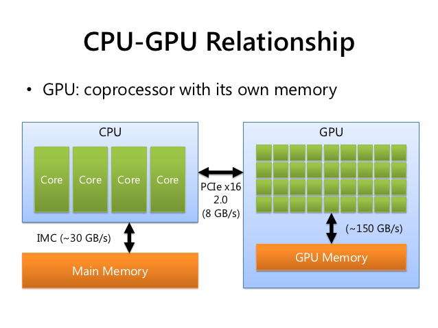
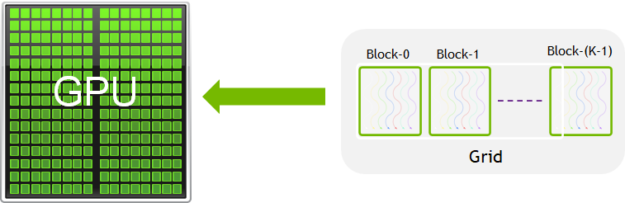
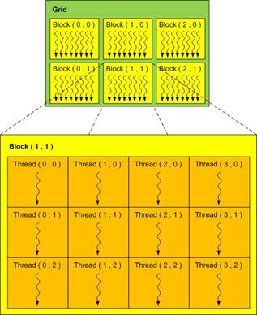

# CUDA Training Resource
The materials in this repository accompany the CUDA Training Series presented at ORNL and NERSC.

You can find the slides and presentation recordings at https://www.olcf.ornl.gov/cuda-training-series/


# Contents
- [CUDA Training Resource](#cuda-training-resource)
- [Contents](#contents)
- [Module 1](#module-1)
  - [Heterogeneous computing](#heterogeneous-computing)
  - [Data parallel computing](#data-parallel-computing)
    - [Data independence](#data-independence)
    - [Data dependence](#data-dependence)
  - [Kernel](#kernel)
  - [Thread](#thread)
  - [Block](#block)
  - [Grid](#grid)
  - [Thread hierarchy](#thread-hierarchy)
  - [Higher dimensional grids/blocks](#higher-dimensional-gridsblocks)

# Module 1

Key things to know:
- Heterogeneous computing
- Data parallel computing
- Kernel
- Thread
- Block
- Grid
- Thread hierarchy 
- Higher dimensional grids/blocks
- Memory spaces
- Data transfers

## Heterogeneous computing

- It means we have multiple processors of different types
- Host: CPU and its memory (host memory)
- Device: GPU and its memory (device memory)


##  Data parallel computing
- Perform operations on a data st organized into a common structure (e.g., an array)
- A set of tasks work collectively and simultaneously on the same structure with each task operating on its own portion of the structure
- Tasks perform identical operations on their portions of the structure. Opertations on each portion must be data independent!
- Data dependence (e.g,. when a program statement refers to the data of a preceeding statement) limits parallelism
- With data independence, identical operations are performed on each of the elements of the data set in parallel, say given, 3 different arrays ```A, B, C```, we compute ```C=A+B```
- GPUs are SIMD

### Data independence
```
a = 3 * x;
b = 10 * x;
c = x * x;
```
### Data dependence

```
a = 8 * x;
b = 2 * a;
c = 14 * b;
```

## Kernel

- The CUDA kernel is a function that gets executed on GPU. 
- The data-parallel portions of your algorithm are executed on the GPU (device) as kernels
- Each kernel is executed in parallel by K different CUDA threads, as opposed to only one time like regular C/C++ functions. 
- Every CUDA kernel starts with a ```__global__``` declaration specifier. Programmers provide a unique global ID to each thread by using built-in variables.
  


## Thread

- Each thread will execute the kernel once
- CUDA gives each thread a unique ThreadID to distinguish between each other even though the kernel instructions are the same.
- CUDA threads are conceptually similar to data-parallel tasks
  - Each thread performs the same operations on a subset of a data structure
  - Threads execute independently
- A group of threads is called a CUDA block. CUDA blocks are grouped into a grid. A kernel is executed as a grid of blocks of threads.



## Block

- A group of threads is called a CUDA block.

## Grid

- CUDA blocks are grouped into a grid. A kernel is executed as a grid of blocks of threads.
- Recall that GPUs are SIMD. This means that each CUDA core gets the same code, called a ‘kernel’. Kernels are programmed to execute one ‘thread’ (execution unit or task). The ‘trick’ is that each thread ‘knows’ its identity, in the form of a grid location, and is usually coded to access an array of data at a unique location for the thread.

## Thread hierarchy



## Higher dimensional grids/blocks
- 1-D grids/blocks are suitable for 1D data, but higher dimensional grids/blocks are necessary for:
    - higher dimensional data.
    - data set larger than the hardware dimensional  limitations of blocks.
- CUDA has built-in variables and structures to define the number of blocks in a grid in each dimension and the number of threads in a block in each dimension.